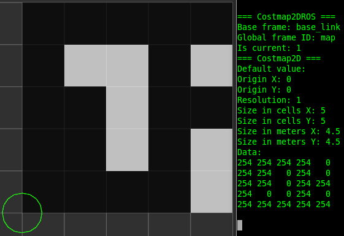
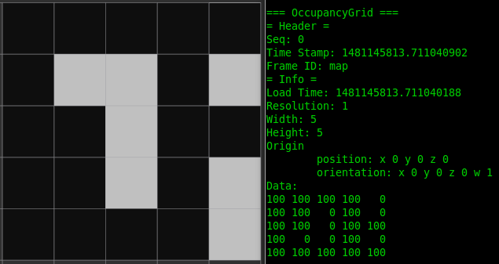
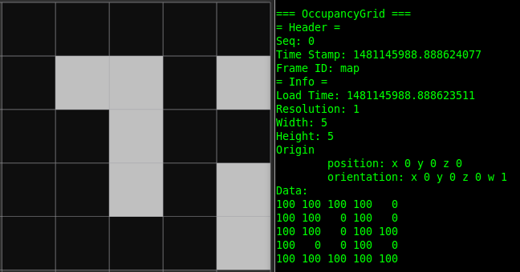
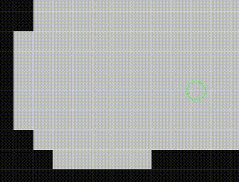

## access_costmap2d
```
$ roslaunch access_costmap2d minimal.launch
```

## access_occupancygrid
```
$ roslaunch access_occupancygrid minimal.launch
```

## access_occupancygrid_by_service
```
$ roslaunch access_occupancygrid_by_service minimal.launch
```

## publish_simple_occupancy_grid
```
$ roslaunch publish_simple_occupancy_grid minimal.launch
```


## publish_change_initialpose_rviz
```
$ roslaunch publish_change_initialpose_rviz minimal.launch
```
